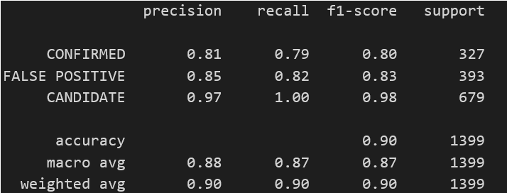

# Machine Learning Homework - Exoplanet Exploration

## Background

Over a period of nine years in deep space, the NASA Kepler space telescope has been out on a planet-hunting mission to discover hidden planets outside of our solar system.

To help process this data, you will create machine learning models capable of classifying candidate exoplanets from the raw dataset.

In this homework assignment, you will need to:

1. [Preprocess the raw data](#Preprocessing)
2. [Tune the models](#Tune-Model-Parameters)
3. [Compare two or more models](#Evaluate-Model-Performance)

- - -

## Instructions

### Preprocess the Data

* Preprocess the dataset prior to fitting the model.
* Perform feature selection and remove unnecessary features.
* Use `MinMaxScaler` to scale the numerical data.
* Separate the data into training and testing data.

### Tune Model Parameters

* Use `GridSearch` to tune model parameters.
* Tune and compare at least two different classifiers.

## Findings and Assumptions

There are huge difference between mean and median(50%) of many columns inn the dataset. For example, column 10 'koi_prad', mean=121 and median=2.42. Which implies it is not normally distributed/ there are outliers.

As there are Outlier values in the dataset. Best Models to go with are: SVC, Decition Tree, Ensemble Technic: Random Forest, or KNN which are not Sensitive to Outliers.

Otherwise, remove  the outliers or replace them with upper bounds or median. Then perform Logistic regression or Neural Network Models which are sensitive to outliers. But as the number of outliers altogether are high in the dataset, better to stick with Models insensitive to outliers. The Accuracy Rate with Deep Learning was only 82% with or without outliers(tried both). Where with Random Forest Ensemble, Accuracy of 89% could be attained. SVC model gave 83% accuracy rate.

I conclude that Random Forest with n_estimators=70 is the best model for solving my problem of Exoplanet classification

